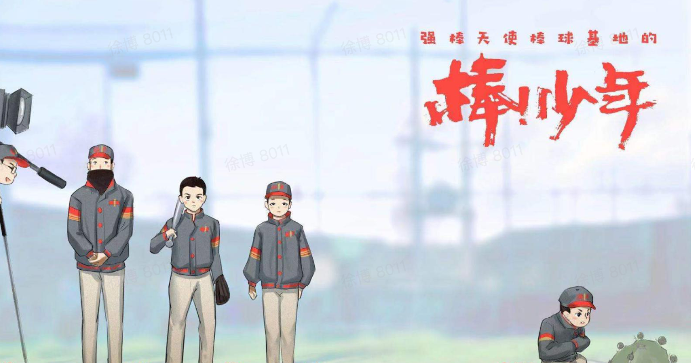
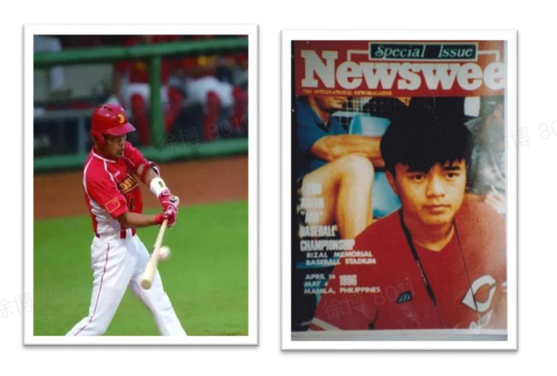
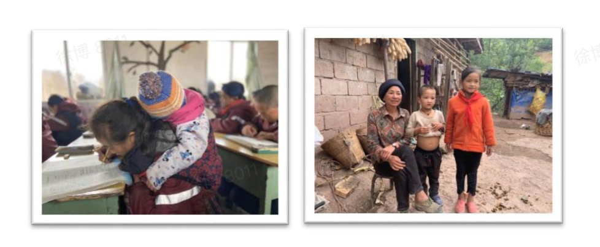
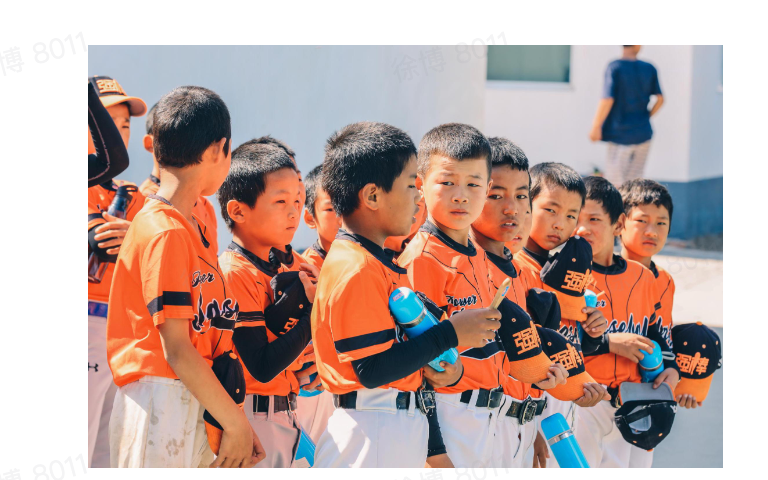
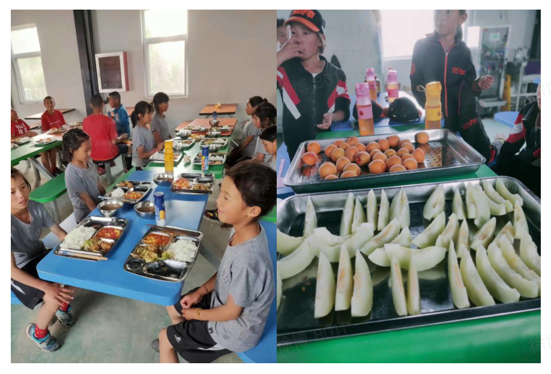
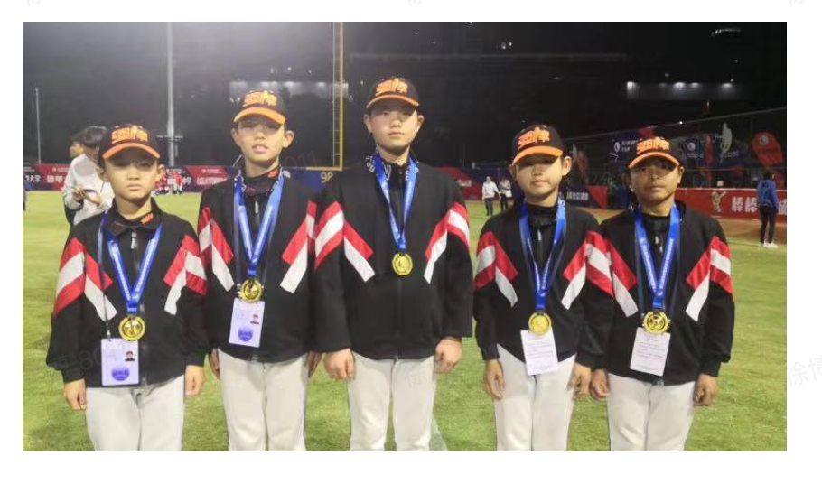
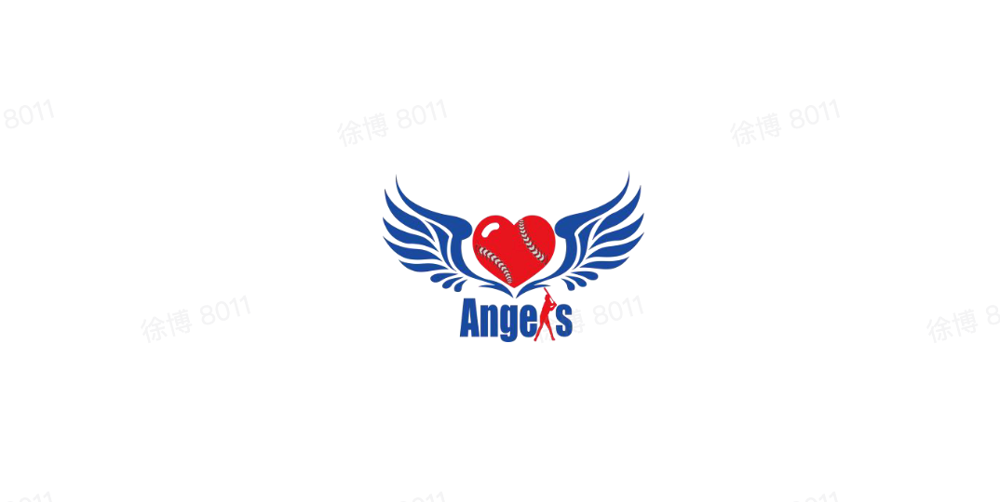

> 强棒基地由前国家棒球队队长孙岭峰与爱心人士联合筹资建设，创建中国第一支公益棒球队。基地主要资助对象为全国范围内 7-10 岁困境儿童，通过专业的棒球技能获得职业发展方向和未来的就业机会。截止到 2020 年11月，项目共资助困境儿童80名，其中女孩 26名，多数儿童来自四川大凉山彝族自治州。通过基地的学习训练，她们重拾了信心也对未来建立目标，部分孩子通过努力训练走向了更大的舞台，获得了更多人的关注和认可。 

2019年12月，第一批女孩入驻强棒天使基地，至今已有26名女孩，最小的6岁，最大14岁。25个来自四川大凉山的彝族姑娘。她们分别组成了U10和U12年龄组，是中国第一支女子棒球队。

、

